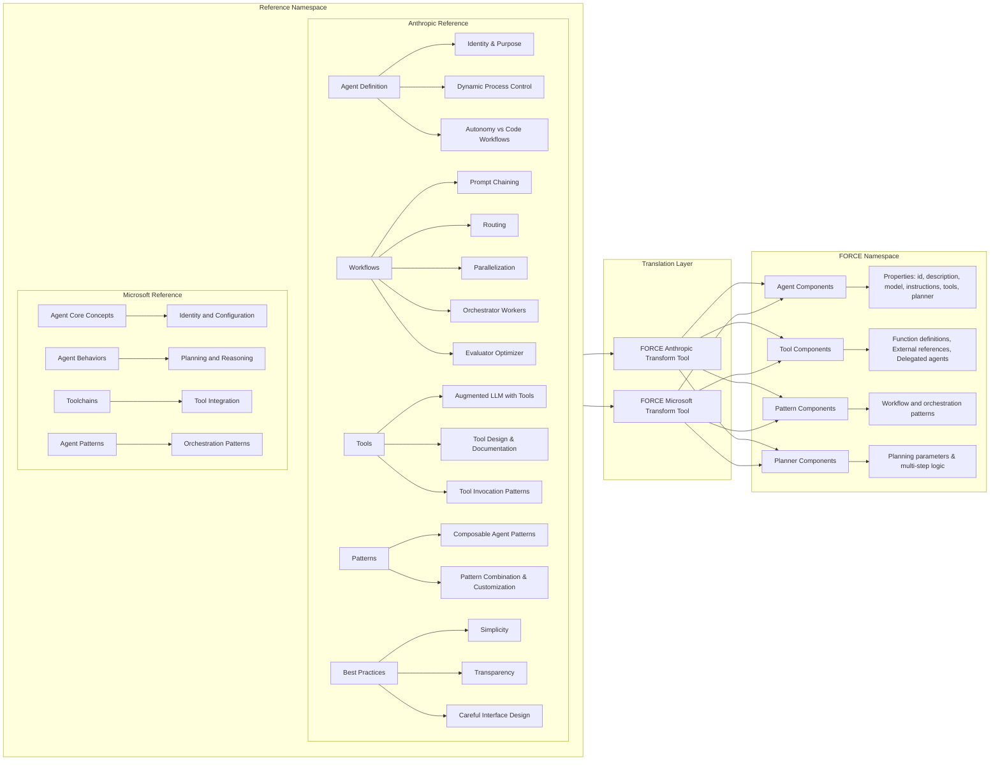

```plantuml
@startuml
package "Reference Namespace" {
  package "Anthropic Reference" {
    [Agent Definition]
    [Workflows]
    [Tools]
    [Patterns]
    [Best Practices]
    [Agent Definition] --> [Identity & Purpose]
    [Agent Definition] --> [Dynamic Process Control]
    [Agent Definition] --> [Autonomy vs Code Workflows]
    [Workflows] --> [Prompt Chaining]
    [Workflows] --> [Routing]
    [Workflows] --> [Parallelization]
    [Workflows] --> [Orchestrator Workers]
    [Workflows] --> [Evaluator Optimizer]
    [Tools] --> [Augmented LLM with Tools]
    [Tools] --> [Tool Design & Documentation]
    [Tools] --> [Tool Invocation Patterns]
    [Patterns] --> [Composable Agent Patterns]
    [Patterns] --> [Pattern Combination & Customization]
    [Best Practices] --> [Simplicity]
    [Best Practices] --> [Transparency]
    [Best Practices] --> [Careful Interface Design]
  }
  package "FORCE Namespace" {
    [Agent Components]
    [Tool Components]
    [Pattern Components]
    [Planner Components]
    [Agent Components] --> [Properties: id, description, model, instructions, tools, planner]
    [Tool Components] --> [Function definitions, External references, Delegated agents]
    [Pattern Components] --> [Workflow and orchestration patterns]
    [Planner Components] --> [Planning parameters & multi-step logic]
  }
  [Anthropic Reference] --> [FORCE Namespace] : "FORCE Anthropic Transform Tool"
}
@enduml