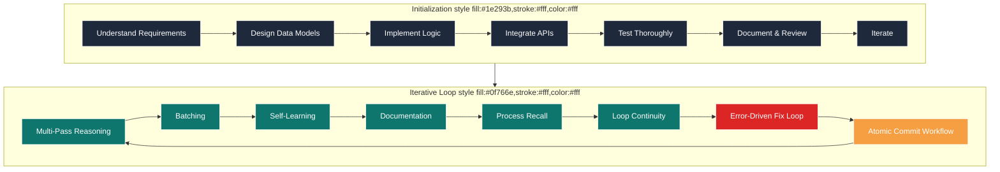

# Iterative Loop Logic: Authoritative Process & Flow

## Purpose
This document defines the iterative loop logic for software development, ensuring all work is performed in a standards-driven, recursive, and test-driven manner. It is agnostic and reusable for any project or agent.

## Core Loop Principles
- **Multi-Pass Reasoning:** Always use a minimum 4-pass reasoning process to determine, define, and refine steps and subtasks (recursively up to 5 levels).
- **Batching:** Intelligently batch as many changes as feasible within each iteration, provided code quality and standards are upheld.
- **Self-Learning:** With each iteration, analyze previous steps and context to become more efficient, adapting batching and process improvements as the codebase evolves.
- **Documentation:** At each pass, update all relevant documentation and integrate it within the authoritative resource for the project.
- **Process Recall:** Before resuming execution, recall the process and all additional context, ensuring confidence in requirements, current task, iterative loop, dependencies, outputs, and conditions.
- **Loop Continuity:** Unless interrupted, always resolve to continue in the predetermined order, as it is tracked and already represents an ideally planned development process flow.
- **Error-Driven Development:** Always check for errors after each iteration and enter a fix loop if any are found, before proceeding.
- **User Approval:** Wait for explicit user approval before major actions.

## Iterative Loop Flowchart & Atomic Commit Workflow

### Atomic Commit Workflow (Branch/Task End)

- Create or switch to a feature branch (e.g., `feat/scaffold`)
- Intelligently group and stage changes for each logical refactor or feature
- Use a multi-line, bullet-pointed commit message for clarity and traceability
- Commit atomically after each major batch
- Repeat until all work is complete, then proceed to PR or merge as per standards

This process enforces traceable, standards-driven, and efficient development cycles.

## References
- [Copilot Instructions for Rigid, Typed, Functional Projects](./copilot-instructions.md)
- [React App Standards](./react-app.standards.instructions.md)
- [Functional Programming Principles](https://en.wikipedia.org/wiki/Functional_programming)
- [Test-Driven Development](https://en.wikipedia.org/wiki/Test-driven_development)
- [Syslog Format](https://tools.ietf.org/html/rfc5424)

---
This file must be updated as process and loop logic evolve.
