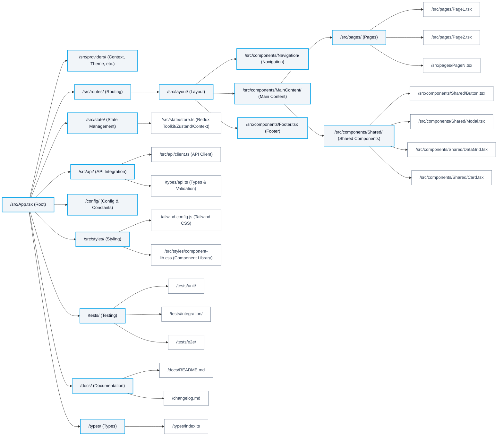

# React Application Development Standards & Best Practices

## Purpose
This document provides comprehensive, authoritative standards and best practices for developing React applications. It is agnostic to any specific project and is intended for use as a reusable, living resource for all contributors.

## Core Principles
- **Strict Typing:** Use TypeScript for all code. Define all data models, API contracts, and component props in `/types` and reference them throughout the codebase.
- **Functional Programming:** Favor pure functions, immutability, and stateless components. Avoid side effects and state mutation. [Functional Programming Principles](https://en.wikipedia.org/wiki/Functional_programming)
- **Component Architecture:** Use stateless, functional UI components. Separate business logic from UI. Centralize configuration and constants in `/config`.
- **State Management:** Use predictable, immutable state management (e.g., Redux Toolkit, Zustand, React Context with useReducer). Document state shape in `/types`.
- **Accessibility:** Ensure WCAG 2.1 AA compliance. Use semantic HTML, ARIA attributes, and test with screen readers. [W3C Accessibility Guidelines](https://www.w3.org/WAI/standards-guidelines/wcag/)
- **Testing:** Implement unit, integration, and end-to-end tests (e.g., Jest, React Testing Library, Cypress). Achieve >90% coverage and document metrics.
- **Linting & Formatting:** Enforce strict linting (ESLint) and formatting (Prettier) rules. [Airbnb JavaScript Style Guide](https://github.com/airbnb/javascript)
- **Documentation:** Use [JSDoc](https://jsdoc.app/) for code comments. Maintain `/docs` for architecture, standards, and API references. Update `/changelog.md` in syslog format for all changes.
- **Version Control:** Use atomic commits with detailed messages. Follow [Semantic Versioning](https://semver.org/). Create branches for major features or iterations.
- **Performance:** Optimize for fast load times and responsiveness. Use code splitting, lazy loading, and efficient data fetching. Monitor with [Lighthouse](https://web.dev/measure/) and [Web Vitals](https://web.dev/vitals/).
- **Telemetry & Metrics:** Record and report coverage, performance, and usage metrics. Update documentation and changelog with each iteration.
- **Security:** Follow [OWASP Top 10](https://owasp.org/www-project-top-ten/) for web application security. Sanitize all user input, validate data, and use HTTPS/TLS for all endpoints.
- **Continuous Improvement:** Use iterative, test-driven development and update standards as the ecosystem evolves.

## UI/UX & Styling
- Use [Tailwind CSS](https://tailwindcss.com/) for utility-first styling. Configure via `tailwind.config.js`.
- Use a modern, accessible component library (e.g., [HeroUI](https://www.heroui.com/), [Headless UI](https://headlessui.com/)).
- Import all component library CSS/JS programmatically in your React entry/layout files. **Do not use static `<link>` or `<script>` tags** for library assets in HTML.
- Ensure all UI is responsive, accessible, and visually consistent.

## API Integration
- All API calls must be strictly typed, validated, and documented.
- Use [OpenAPI](https://swagger.io/specification/) or [JSON Schema](https://json-schema.org/) for API contracts.
- Handle errors, loading, and empty states gracefully in the UI.

## References & Further Reading
- [React Official Docs](https://react.dev/)
- [TypeScript Handbook](https://www.typescriptlang.org/docs/)
- [Tailwind CSS Docs](https://tailwindcss.com/docs/installation)
- [HeroUI Docs](https://www.heroui.com/docs/guide/introduction)
- [Redux Toolkit](https://redux-toolkit.js.org/)
- [Jest Testing Framework](https://jestjs.io/)
- [Cypress End-to-End Testing](https://www.cypress.io/)
- [OpenAPI Specification](https://swagger.io/specification/)
- [OWASP Top 10 Security Risks](https://owasp.org/www-project-top-ten/)
- [WCAG Accessibility Guidelines](https://www.w3.org/WAI/standards-guidelines/wcag/)
- [Airbnb JavaScript Style Guide](https://github.com/airbnb/javascript)
- [JSDoc Documentation](https://jsdoc.app/)
- [Semantic Versioning](https://semver.org/)

## Process
1. **Understand Requirements:** Review `/docs/PLANNING.md` and related documentation.
2. **Design Data Models:** Define all types and interfaces in `/types`.
3. **Implement Logic:** Write pure, typed functions and stateless components.
4. **Integrate APIs:** Validate and document all endpoints.
5. **Test Thoroughly:** Achieve high coverage and deterministic outputs.
6. **Document & Review:** Update all docs, changelogs, and references.
7. **Iterate:** Use a multi-pass reasoning process for continuous improvement.

---
This file must be updated as standards and best practices evolve.
