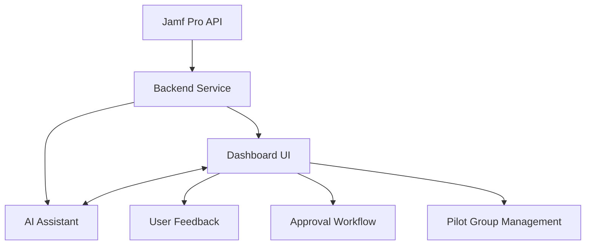

# Jamf Pro ITIL/ITAM Dashboard Planning Documentation

| Field    | Value |
|----------|-------|
| Project  | Jamf Pro ITIL/ITAM Dashboard |
| Author   | Jeremiah Pegues |
| Company  | Pegues OPSCORP |
| License  | Exclusive non-perpetual license to VERSUS VERSUS VERSUS LLC dba 3VS Vantage, transferrable to authorized clients |
| Email    | jeremiah@pegues.io |
| Version  | 0.1 (Planning) |
---
### References:
- Jamf Pro Documentation: https://learn.jamf.com/en-US/bundle/jamf-pro-documentation-10.44.0/page/Jamf_Pro_Documentation.html
- ITIL: https://www.axelos.com/best-practice-solutions/itil
- ITAM: https://www.itassetmanagement.net/itam-standards/
- Mac OS Configuration Profiles: https://developer.apple.com/documentation/devicemanagement/configuration_profiles
## Overview
This project aims to deliver a responsive, highly interactive dashboard for Jamf Pro administrators, enabling:
- Data gathering and analysis via Jamf Pro API
- Identification and remediation of duplicate/conflicting/unused policies & profiles
- Grouping, refactoring, and pilot group assignment
- Approval workflows and scheduling
- Chat-based AI assistant for diagnostics, reporting, and feedback

## Architecture



## Key Features
- Jamf Pro API integration
- Policy/profile analysis (duplicate, conflict, unused)
- Refactoring and remediation tools
- Pilot group creation and management
- Approval and scheduling workflows
- Chat interface with AI assistant
- Responsive, accessible UI/UX (drag-and-drop, filters, tags, animations)

## Dependencies
- Jamf Pro API access
- jQuery, drag-and-drop JS libs, CSS frameworks
- Authentication (Jamf API user)
- Node.js/Express (suggested backend)
- React/Vue/Angular (suggested frontend)

## Best Practices
- Align with ITIL/ITAM for lifecycle management
- Use Jamf Pro API efficiently (rate limits, pagination)
- Ensure security (API credentials, HTTPS)
- Maintain version control and documentation
- Reference official docs and standards
- Always verify fixes and solutions with authoritative online resources before applying (e.g., MDN, official docs)
- For every fix, outline the problem, diagnosis steps, method of resolution, authoritative reference, and steps taken
- In recursive processes, provide insights for reducing attempts (e.g., note deprecated commands, recommend alternatives, enforce stricter verification)

## Visual Aids
- Mermaid diagrams for architecture and workflows
- PlantUML for complex process flows

## Documentation Standards
- Version control comments at file top
- Inline commentary for support and future development
- Reference links and anchors

## Next Steps
1. Define API endpoints and data models
2. Integrate iterative development process:
   - At each iteration, batch feasible changes for efficiency while upholding standards
   - After each change, document learnings, problems, diagnosis, fix, and reference
   - Continuously update best practices and planning docs with new learnings
   - Enforce self-learning and process improvement as governing principles
   - Policies: /JSSResource/policies
   - Configuration Profiles: /JSSResource/osxconfigurationprofiles
   - Patch Management: /JSSResource/patches
   - Directory Connections: /JSSResource/ldapservers
   - Groups: /JSSResource/computergroups
   - Users: /JSSResource/users
   - Devices: /JSSResource/computers
   - Categories: /JSSResource/categories
   - Smart/Static Groups: /JSSResource/computergroups
   - Approval Workflow: /api/v1/approval
   - Feedback: /api/v1/feedback

   ### Data Models (Example)
   - Policy: { id, name, scope, category, enabled, triggers, payloads }
   - Profile: { id, name, scope, category, payloads, conflicts }
   - Patch: { id, name, version, status, devices }
   - Group: { id, name, type, members }
   - User: { id, username, groups, devices }
   - Device: { id, name, serial, group, policies, profiles }
   - Approval: { id, item, status, approvers, schedule }
   - Feedback: { id, user, item, comments, rating }

2. Design UI wireframes and workflows
   - Dashboard: Overview, analytics, quick actions
   - Policy/Profile Analyzer: List, filter, duplicate/conflict detection
   - Remediation Tools: Refactor, merge, delete, assign
   - Pilot Group Management: Create, assign, schedule
   - Approval Workflow: Request, approve, schedule, notify
   - Chat Assistant: Query, report, suggest, notify

   ### UI Wireframe (Mermaid)
   ```mermaid
   graph TD
       A[Dashboard] --> B[Policy/Profile Analyzer]
       A --> C[Pilot Group Management]
       A --> D[Approval Workflow]
       A --> E[Chat Assistant]
       B --> F[Remediation Tools]
       C --> G[Group Assignment]
       D --> H[Notifications]
   ```

   ### Workflow (PlantUML)
   ```plantuml
   @startuml
   start
   :Query Jamf API;
   :Analyze Data;
   :Detect Issues;
   :Suggest Remediation;
   :Assign to Pilot Group;
   :Request Approval;
   :Schedule Change;
   :Notify Users;
   :Collect Feedback;
   stop
   @enduml
   ```

3. Implement backend service for Jamf API integration
   - Use Node.js/Express for RESTful API proxy
   - Secure API credentials (env vars, vault)
   - Handle rate limits, pagination, error handling
   - Cache periodic queries for chat assistant
   - Log and audit all actions

4. Build frontend dashboard and chat assistant
   - Use React (recommended) for SPA
   - Integrate jQuery modules for drag-and-drop, filters
   - Use CSS frameworks (Tailwind, Bootstrap) for responsive UI
   - Implement accessibility (WCAG, ARIA)
   - Animate transitions and feedback

5. Test, document, and iterate
   - Unit/integration tests for backend and frontend
   - User acceptance testing (UAT) with pilot groups
   - Continuous documentation updates
   - Version control with detailed comments
   - Reference all standards and best practices

---
## Commentary & Best Practices
- All API endpoints and data models are based on Jamf Pro 10.44.1 schema ([API Reference](https://learn.jamf.com/en-US/bundle/jamf-pro-documentation-10.44.0/page/Jamf_Pro_Documentation.html)).
- UI/UX follows accessibility and responsive design standards.
- ITIL/ITAM alignment ensures lifecycle management and asset tracking.
- Security: API credentials must be protected, HTTPS enforced, audit logging enabled.
- Documentation: Inline comments, version control, and links to official resources for support and future development.
2. Design UI wireframes and workflows
3. Implement backend service for Jamf API integration
4. Build frontend dashboard and chat assistant
5. Test, document, and iterate

---
For further details, see:
- [Jamf Pro Documentation](https://learn.jamf.com/en-US/bundle/jamf-pro-documentation-10.44.0/page/Jamf_Pro_Documentation.html)
- [ITIL Best Practices](https://www.axelos.com/best-practice-solutions/itil)
- [ITAM Standards](https://www.itassetmanagement.net/itam-standards/)
- [Mac OS Configuration Profiles](https://developer.apple.com/documentation/devicemanagement/configuration_profiles)
