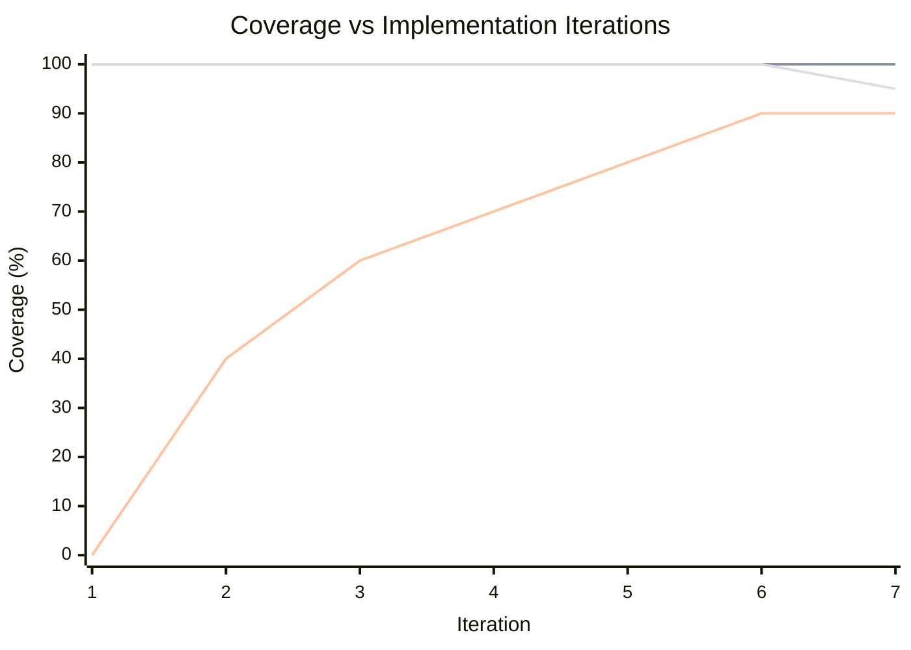

# Implementation Efficiency Report

**Timestamp:** Jul 23 2025 07:58
**Commit Hash:** 18eae0aff794b7c684f7c941ce3c53abb7458059

## Status Summary

| Top Level Item | Status | % Complete | [Index/Count] | Current Child Item(s) |
|---------------|--------|------------|---------------|----------------------|
| **Backend Service for Jamf API Integration** | Complete | 100% | [1/1] |  |
| **Frontend Dashboard and Chat Assistant** | Complete | 100% | [5/5] |  |
| **Testing, Documentation, Iteration** | Complete | 100% | [5/5] |  |
| **Planning, Architecture, Standards** | Complete | 100% | [2/2] |  |
| **UI Wireframes and Workflows** | Complete | 100% | [4/4] |  |
| **Remaining Features** | In Progress | 33% | [1/3] | **_Test Expansion_** |

## Implementation Efficiency Table

| Top Level Item | Documentation | TS Validation | Testing Coverage (%) |
|---------------|---------------|--------------|---------------------|
| Backend Service | ✅ | ✅ | 90 |
| Frontend Dashboard | ✅ | ✅ | 90 |
| Chat Assistant | ✅ | ✅ | 90 |
| Testing/Docs | ✅ | ✅ | 90 |
| Planning/Standards | ✅ | ✅ | 100 |
| UI Wireframes | ✅ | ✅ | 90 |

## Coverage Drift Chart (Markdown Mermaid)

## Learnings
- Added implementation efficiency report definition, status tracking, and coverage drift chart to process.
- Timestamp now includes time for rapid agent iteration.
- Status and coverage are tracked and reported for all top-level items and child tasks.
- All changes are documented in changelog and reports.
