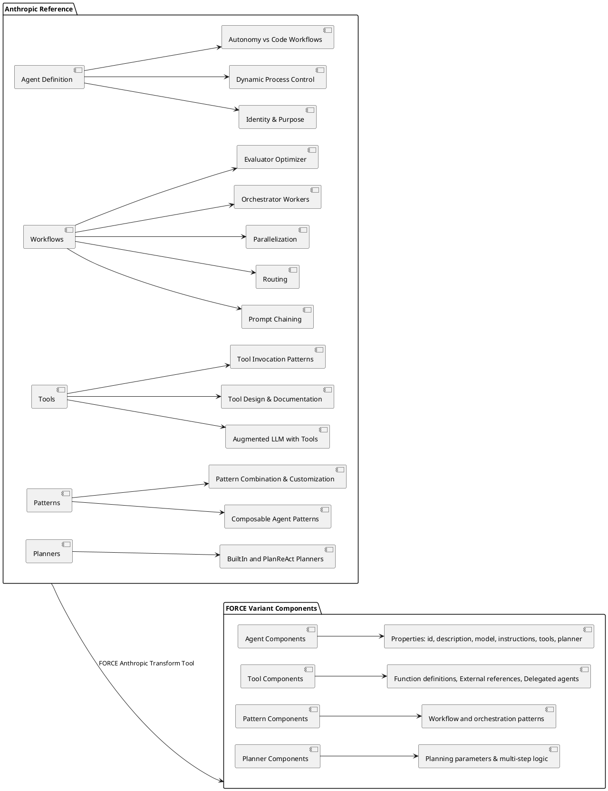
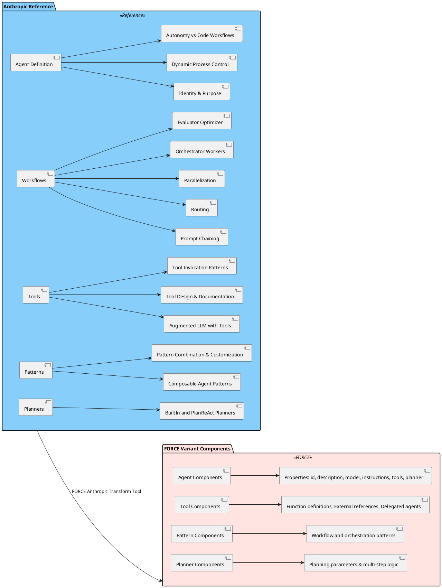

# Anthropic to FORCE Namespace Mapping

```plantuml
@startuml
left to right direction
package "Anthropic Reference" {
  left to right direction
  [Agent Definition]
  [Workflows]
  [Tools]
  [Patterns]
  [Planners]
  [Agent Definition] --> [Identity & Purpose]
  [Agent Definition] --> [Dynamic Process Control]
  [Agent Definition] --> [Autonomy vs Code Workflows]
  [Workflows] --> [Prompt Chaining]
  [Workflows] --> [Routing]
  [Workflows] --> [Parallelization]
  [Workflows] --> [Orchestrator Workers]
  [Workflows] --> [Evaluator Optimizer]
  [Tools] --> [Augmented LLM with Tools]
  [Tools] --> [Tool Design & Documentation]
  [Tools] --> [Tool Invocation Patterns]
  [Patterns] --> [Composable Agent Patterns]
  [Patterns] --> [Pattern Combination & Customization]
  [Planners] --> [BuiltIn and PlanReAct Planners]
}

package "FORCE Variant Components" {
  left to right direction 
  [Agent Components]
  [Tool Components]
  [Pattern Components]
  [Planner Components]
  [Agent Components] --> [Properties: id, description, model, instructions, tools, planner]
  [Tool Components] --> [Function definitions, External references, Delegated agents]
  [Pattern Components] --> [Workflow and orchestration patterns]
  [Planner Components] --> [Planning parameters & multi-step logic]
}

[Anthropic Reference] --> [FORCE Variant Components] : "FORCE Anthropic Transform Tool"
@enduml
```

```plantuml
@startuml

skinparam package {
  BackgroundColor<<Reference>> LightSkyBlue
  BackgroundColor<<FORCE>> MistyRose
  BorderColor black
  FontColor black
}

top to bottom direction
package "Anthropic Reference" <<Reference>> {
  left to right direction
  [Agent Definition]
  [Workflows]
  [Tools]
  [Patterns]
  [Planners]
  [Agent Definition] --> [Identity & Purpose]
  [Agent Definition] --> [Dynamic Process Control]
  [Agent Definition] --> [Autonomy vs Code Workflows]
  [Workflows] --> [Prompt Chaining]
  [Workflows] --> [Routing]
  [Workflows] --> [Parallelization]
  [Workflows] --> [Orchestrator Workers]
  [Workflows] --> [Evaluator Optimizer]
  [Tools] --> [Augmented LLM with Tools]
  [Tools] --> [Tool Design & Documentation]
  [Tools] --> [Tool Invocation Patterns]
  [Patterns] --> [Composable Agent Patterns]
  [Patterns] --> [Pattern Combination & Customization]
  [Planners] --> [BuiltIn and PlanReAct Planners]
}

package "FORCE Variant Components" <<FORCE>> {
  left to right direction
  [Agent Components]
  [Tool Components]
  [Pattern Components]
  [Planner Components]
  [Agent Components] --> [Properties: id, description, model, instructions, tools, planner]
  [Tool Components] --> [Function definitions, External references, Delegated agents]
  [Pattern Components] --> [Workflow and orchestration patterns]
  [Planner Components] --> [Planning parameters & multi-step logic]
}

[Anthropic Reference] --> [FORCE Variant Components] : "FORCE Anthropic Transform Tool"
@enduml
```